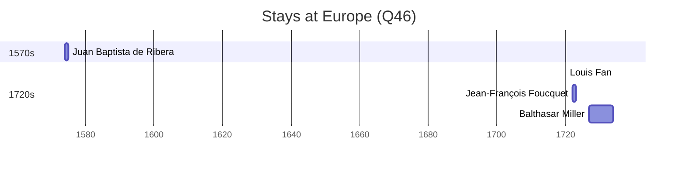

# Europe (Q46)

*terrestrial continent located in north-western Eurasia*

Wikidata: [Q46](https://www.wikidata.org/wiki/Q46)

20 occurrence(s) across 1 transcribed value(s), 17 person(s).

**Transcribed variants:**

- `Europa` (20×, 1574–1772)

| Date | Variant | Person | Type | Entity id | Real entity |
|------|---------|--------|------|-----------|-------------|
| — | Europa | François Noël | estadia | [deh-francois-noel](deh-francois-noel) | — |
| — | Europa | Gerard Arnould Rijckewaert | partida | [deh-gerard-arnould-rijckewaert](deh-gerard-arnould-rijckewaert) | — |
| — | Europa | Manuel de Sá | estadia | [deh-manuel-de-sa](deh-manuel-de-sa) | — |
| — | Europa | Matias de Sousa | estadia | [deh-matias-de-sousa](deh-matias-de-sousa) | — |
| — | Europa | Nicolau da Fonseca | partida | [deh-nicolau-da-fonseca](deh-nicolau-da-fonseca) | — |
| 1574 | Europa | Juan Baptista de Ribera | estadia | [deh-juan-baptista-de-ribera](deh-juan-baptista-de-ribera) | — |
| 1681 | Europa | Michel Alfonso Chen | partida | [deh-michel-alfonso-chen](deh-michel-alfonso-chen) | — |
| 1684 | Europa | Domenico Fuciti | partida | [deh-domenico-fuciti](deh-domenico-fuciti) | — |
| 1694 | Europa | Miguel do Amaral | partida | [deh-miguel-do-amaral](deh-miguel-do-amaral) | [rp086368](rp086368) |
| 1707 | Europa | Charles de Belleville | partida | [deh-charles-de-belleville](deh-charles-de-belleville) | [rp033271](rp033271) |
| 1708-01-14 | Europa | François Noël | partida | [deh-francois-noel](deh-francois-noel) | — |
| 1708-01-14 | Europa | José Ramón Arxó | partida | [deh-francois-noel-ref2](deh-francois-noel-ref2) | — |
| 1708-01-14 | Europa | Louis Fan | partida | [deh-francois-noel-ref3](deh-francois-noel-ref3) | — |
| 1708-01-14 | Europa | Antonio Francesco Giuseppe Provana | partida | [deh-francois-noel-ref4](deh-francois-noel-ref4) | — |
| 1720 | Europa | Jean-François Foucquet | partida | [deh-jean-francois-foucquet](deh-jean-francois-foucquet) | — |
| 1720 | Europa | Louis Fan | jesuita-ordenacao-padre | [deh-louis-fan](deh-louis-fan) | — |
| 1722 | Europa | Miguel do Amaral | partida | [deh-miguel-do-amaral](deh-miguel-do-amaral) | [rp086368](rp086368) |
| 1722-01-09 | Europa | Jean-François Foucquet | chegada | [deh-jean-francois-foucquet](deh-jean-francois-foucquet) | — |
| 1727 | Europa | Balthasar Miller | estadia | [deh-balthasar-miller](deh-balthasar-miller) | — |
| 1772 | Europa | Francisco da Silva | morte | [deh-francisco-da-silva-iii](deh-francisco-da-silva-iii) | — |

