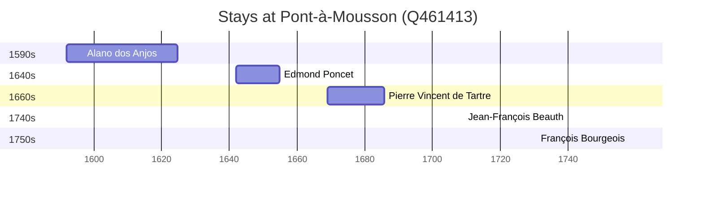

# Pont-à-Mousson (Q461413)

*commune in Meurthe-et-Moselle, France*

Wikidata: [Q461413](https://www.wikidata.org/wiki/Q461413)

6 occurrence(s) across 1 transcribed value(s), 5 person(s).

**Transcribed variants:**

- `Pont-à-Mousson` (6×, 1592–1758)

| Date | Variant | Person | Type | Entity id | Real entity |
|------|---------|--------|------|-----------|-------------|
| 1592 | Pont-à-Mousson | Alano dos Anjos | nascimento | [deh-alano-dos-anjos](deh-alano-dos-anjos) | — |
| 1642 | Pont-à-Mousson | Edmond Poncet | estadia | [deh-edmond-poncet](deh-edmond-poncet) | — |
| 1648-06-29 | Pont-à-Mousson | Edmond Poncet | jesuita-votos-local | [deh-edmond-poncet](deh-edmond-poncet) | — |
| 1669-01-22 | Pont-à-Mousson | Pierre Vincent de Tartre | nascimento | [deh-pierre-vincent-de-tartre](deh-pierre-vincent-de-tartre) | — |
| 1740-02-02 | Pont-à-Mousson | Jean-François Beauth | jesuita-votos-local | [deh-jean-francois-beauth](deh-jean-francois-beauth) | — |
| 1758-02-02 | Pont-à-Mousson | François Bourgeois | jesuita-votos-local | [deh-francois-bourgeois](deh-francois-bourgeois) | — |

