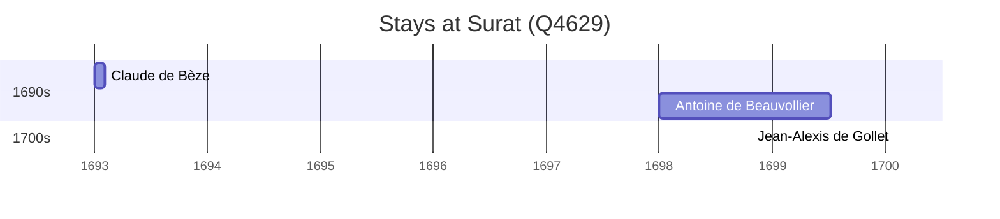

# Surat (Q4629)

*city in Gujarat, India*

Wikidata: [Q4629](https://www.wikidata.org/wiki/Q4629)

3 occurrence(s) across 1 transcribed value(s), 3 person(s).

**Transcribed variants:**

- `Surat` (3×, 1693–1700)

| Date | Variant | Person | Type | Entity id | Real entity |
|------|---------|--------|------|-----------|-------------|
| 1693-01 | Surat | Claude de Bèze | estadia | [deh-claude-de-beze](deh-claude-de-beze) | — |
| 1698 | Surat | Antoine de Beauvollier | estadia | [deh-antoine-de-beauvollier](deh-antoine-de-beauvollier) | — |
| 1700-02-02 | Surat | Jean-Alexis de Gollet | jesuita-votos-local | [deh-jean-alexis-de-gollet](deh-jean-alexis-de-gollet) | — |

