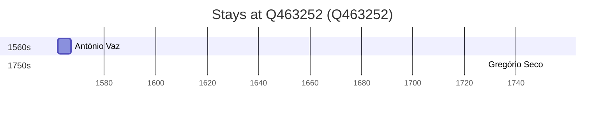

# Q463252

*(fetch error: HTTP Error 429: Too Many Requests)*

Wikidata: [Q463252](https://www.wikidata.org/wiki/Q463252)

3 occurrence(s) across 1 transcribed value(s), 2 person(s).

**Transcribed variants:**

- `Damão` (3×, 1562–1752)

| Date | Variant | Person | Type | Entity id | Real entity |
|------|---------|--------|------|-----------|-------------|
| 1562 | Damão | António Vaz | estadia | [deh-antonio-vaz-ref1](deh-antonio-vaz-ref1) | — |
| 1566 | Damão | António Vaz | estadia | [deh-antonio-vaz-ref1](deh-antonio-vaz-ref1) | — |
| 1752 | Damão | Gregório Seco | estadia | [deh-gregorio-seco](deh-gregorio-seco) | — |

