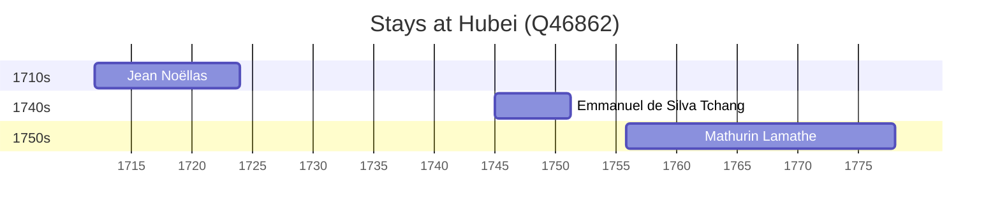

# Hubei (Q46862)

*province of China*

Wikidata: [Q46862](https://www.wikidata.org/wiki/Q46862)

5 occurrence(s) across 2 transcribed value(s), 4 person(s).

**Transcribed variants:**

- `Hupei` (3×, 1712–1742)
- `Hou-pei` (2×, 1745–1755)

| Date | Variant | Person | Type | Entity id | Real entity |
|------|---------|--------|------|-----------|-------------|
| — | Hupei | Claude-François Loppin | estadia | [deh-claude-francois-loppin](deh-claude-francois-loppin) | — |
| 1712 | Hupei | Jean Noëllas | estadia | [deh-jean-noellas](deh-jean-noellas) | — |
| 1742-08-21 | Hupei | Claude-François Loppin | morte | [deh-claude-francois-loppin](deh-claude-francois-loppin) | — |
| 1745 | Hou-pei | Emmanuel de Silva Tchang | estadia | [deh-emmanuel-de-silva-tchang](deh-emmanuel-de-silva-tchang) | [rp840713](rp840713) |
| 1755-11 | Hou-pei | Mathurin Lamathe | estadia | [deh-mathurin-lamathe](deh-mathurin-lamathe) | — |

