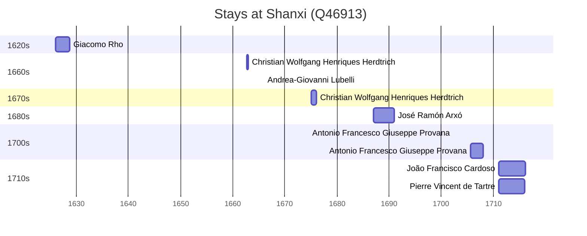

# Shanxi (Q46913)

*province of central China with its capital at Taoyuan, the supposed original home of the prehistoric Huaxia*

Wikidata: [Q46913](https://www.wikidata.org/wiki/Q46913)

10 occurrence(s) across 3 transcribed value(s), 8 person(s).

**Transcribed variants:**

- `Chan-si` (1×, 1626–1626)
- `Shansi` (7×, 1662–1711)
- `Shansi-Shensi` (2×, undated)

| Date | Variant | Person | Type | Entity id | Real entity |
|------|---------|--------|------|-----------|-------------|
| — | Shansi | Francesco Sambiasi | estadia | [deh-francesco-sambiasi](deh-francesco-sambiasi) | — |
| 1626 | Chan-si | Giacomo Rho | estadia | [deh-giacomo-rho](deh-giacomo-rho) | — |
| 1662-10 | Shansi | Christian Wolfgang Henriques Herdtrich | estadia | [deh-christian-wolfgang-henriques-herdtrich](deh-christian-wolfgang-henriques-herdtrich) | [rp669413](rp669413) |
| 1675 | Shansi | Christian Wolfgang Henriques Herdtrich | estadia | [deh-christian-wolfgang-henriques-herdtrich](deh-christian-wolfgang-henriques-herdtrich) | [rp669413](rp669413) |
| 1687 | Shansi | José Ramón Arxó | estadia | [deh-jose-ramon-arxo](deh-jose-ramon-arxo) | — |
| 1702-05-25 | Shansi | Antonio Francesco Giuseppe Provana | jesuita-votos-local | [deh-antonio-francesco-giuseppe-provana](deh-antonio-francesco-giuseppe-provana) | [rp445313](rp445313) |
| 1705-08 | Shansi | Antonio Francesco Giuseppe Provana | estadia | [deh-antonio-francesco-giuseppe-provana](deh-antonio-francesco-giuseppe-provana) | [rp445313](rp445313) |
| 1711 | Shansi | Pierre Vincent de Tartre | estadia | [deh-pierre-vincent-de-tartre](deh-pierre-vincent-de-tartre) | — |
| >1666:<1685 | Shansi-Shensi | Andrea-Giovanni Lubelli | estadia | [deh-andrea-giovanni-lubelli](deh-andrea-giovanni-lubelli) | — |
| >1711 | Shansi-Shensi | João Francisco Cardoso | estadia | [deh-joao-francisco-cardoso](deh-joao-francisco-cardoso) | — |

### Co-presence

These persons were plausibly at this place during overlapping periods (interval estimation from stay dates; rough — see method note below).

| Period | Persons |
|--------|---------|
| 1710s | [João Francisco Cardoso](deh-joao-francisco-cardoso), [Pierre Vincent de Tartre](deh-pierre-vincent-de-tartre) |

*1 overlapping pair(s) involving 2 person(s). Method: interval start = stay event date; end = next embarque/partida/different-place event, or death, or +15yr cap.*

