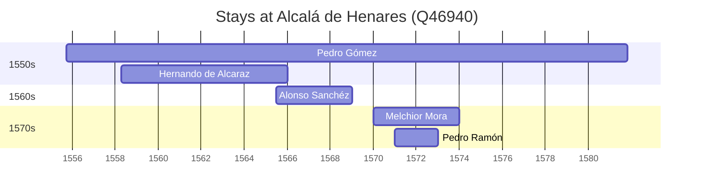

# Alcalá de Henares (Q46940)

*city of Spain in the Community of Madrid*

Wikidata: [Q46940](https://www.wikidata.org/wiki/Q46940)

6 occurrence(s) across 1 transcribed value(s), 5 person(s).

**Transcribed variants:**

- `Alcalá` (6×, 1555–1593)

| Date | Variant | Person | Type | Entity id | Real entity |
|------|---------|--------|------|-----------|-------------|
| 1555-09-25 | Alcalá | Pedro Gómez | jesuita-entrada | [deh-pedro-gomez](deh-pedro-gomez) | — |
| 1558-04-13 | Alcalá | Hernando de Alcaraz | jesuita-entrada | [deh-hernando-de-alcaraz](deh-hernando-de-alcaraz) | — |
| 1565-07-02 | Alcalá | Alonso Sanchéz | jesuita-entrada | [deh-alonso-sanchez](deh-alonso-sanchez) | — |
| 1570 | Alcalá | Melchior Mora | jesuita-entrada | [deh-melchior-mora](deh-melchior-mora) | — |
| 1571 | Alcalá | Pedro Ramón | jesuita-entrada | [deh-pedro-ramon](deh-pedro-ramon) | — |
| 1593-05-27 | Alcalá | Alonso Sanchéz | morte | [deh-alonso-sanchez](deh-alonso-sanchez) | — |

### Co-presence

These persons were plausibly at this place during overlapping periods (interval estimation from stay dates; rough — see method note below).

| Period | Persons |
|--------|---------|
| 1550s | [Hernando de Alcaraz](deh-hernando-de-alcaraz), [Pedro Gómez](deh-pedro-gomez) |
| 1560s | [Alonso Sanchéz](deh-alonso-sanchez), [Hernando de Alcaraz](deh-hernando-de-alcaraz), [Pedro Gómez](deh-pedro-gomez) |
| 1570s | [Melchior Mora](deh-melchior-mora), [Pedro Gómez](deh-pedro-gomez), [Pedro Ramón](deh-pedro-ramon) |

*6 overlapping pair(s) involving 5 person(s). Method: interval start = stay event date; end = next embarque/partida/different-place event, or death, or +15yr cap.*

