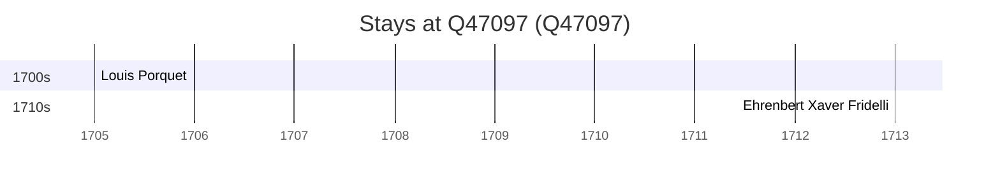

# Q47097

*(fetch error: HTTP Error 429: Too Many Requests)*

Wikidata: [Q47097](https://www.wikidata.org/wiki/Q47097)

2 occurrence(s) across 1 transcribed value(s), 2 person(s).

**Transcribed variants:**

- `Kweichow` (2×, 1705–1713)

| Date | Variant | Person | Type | Entity id | Real entity |
|------|---------|--------|------|-----------|-------------|
| 1705 | Kweichow | Louis Porquet | estadia | [deh-louis-porquet](deh-louis-porquet) | [rp585015](rp585015) |
| 1713 | Kweichow | Ehrenbert Xaver Fridelli | estadia | [deh-ehrenbert-xaver-fridelli](deh-ehrenbert-xaver-fridelli) | — |

