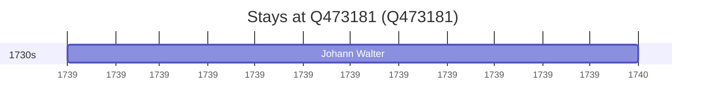

# Q473181

*(fetch error: HTTP Error 429: Too Many Requests)*

Wikidata: [Q473181](https://www.wikidata.org/wiki/Q473181)

2 occurrence(s) across 2 transcribed value(s), 2 person(s).

**Transcribed variants:**

- `Costa do Malabar` (1×, 1630–1630)
- `Malabar` (1×, 1739–1739)

| Date | Variant | Person | Type | Entity id | Real entity |
|------|---------|--------|------|-----------|-------------|
| 1630 | Costa do Malabar | Vincenzo Carruba | morte | [deh-vincenzo-carruba](deh-vincenzo-carruba) | — |
| 1739 | Malabar | Johann Walter | estadia | [deh-johann-walter](deh-johann-walter) | — |

