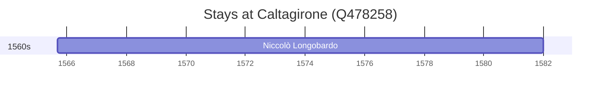

# Caltagirone (Q478258)

*Italian comune*

Wikidata: [Q478258](https://www.wikidata.org/wiki/Q478258)

1 occurrence(s) across 1 transcribed value(s), 1 person(s).

**Transcribed variants:**

- `Caltagirone, Sicília` (1×, 1565–1565)

| Date | Variant | Person | Type | Entity id | Real entity |
|------|---------|--------|------|-----------|-------------|
| 1565-09-10 | Caltagirone, Sicília | Niccolò Longobardo | nascimento | [deh-niccolo-longobardo](deh-niccolo-longobardo) | — |

