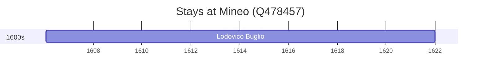

# Mineo (Q478457)

*Italian comune*

Wikidata: [Q478457](https://www.wikidata.org/wiki/Q478457)

1 occurrence(s) across 1 transcribed value(s), 1 person(s).

**Transcribed variants:**

- `Mineo, Catânia, Sicília` (1×, 1606–1606)

| Date | Variant | Person | Type | Entity id | Real entity |
|------|---------|--------|------|-----------|-------------|
| 1606-01-26 | Mineo, Catânia, Sicília | Lodovico Buglio | nascimento | [deh-lodovico-buglio](deh-lodovico-buglio) | — |

