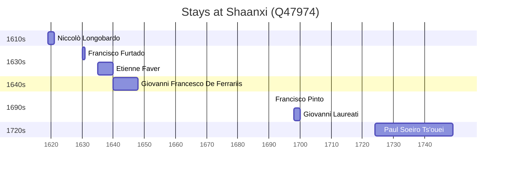

# Shaanxi (Q47974)

*province of central China with its capital Xi'an, the ancient homeland of the Zhou and center of several major dynasty*

Wikidata: [Q47974](https://www.wikidata.org/wiki/Q47974)

9 occurrence(s) across 2 transcribed value(s), 9 person(s).

**Transcribed variants:**

- `Shensi` (6×, 1619–1698)
- `Chen-si` (3×, 1691–1724)

| Date | Variant | Person | Type | Entity id | Real entity |
|------|---------|--------|------|-----------|-------------|
| — | Chen-si | Claude Motel | estadia | [deh-claude-motel](deh-claude-motel) | — |
| — | Shensi | Louis-Daniel Le Comte | estadia | [deh-louis-daniel-le-comte](deh-louis-daniel-le-comte) | — |
| 1619 | Shensi | Niccolò Longobardo | estadia | [deh-niccolo-longobardo](deh-niccolo-longobardo) | — |
| 1630 | Shensi | Francisco Furtado | estadia | [deh-francisco-furtado](deh-francisco-furtado) | — |
| 1635 | Shensi | Etienne Faver | estadia | [deh-etienne-faber](deh-etienne-faber) | — |
| 1640 | Shensi | Giovanni Francesco De Ferrariis | estadia | [deh-giovanni-francesco-de-ferrariis](deh-giovanni-francesco-de-ferrariis) | — |
| 1691 | Chen-si | Francisco Pinto | estadia | [deh-francisco-pinto-i](deh-francisco-pinto-i) | — |
| 1698 | Shensi | Giovanni Laureati | estadia | [deh-giovanni-laureati](deh-giovanni-laureati) | [rp323905](rp323905) |
| 1724 | Chen-si | Paul Soeiro Ts'ouei | nascimento | [deh-paul-soeiro-tsouei](deh-paul-soeiro-tsouei) | — |

