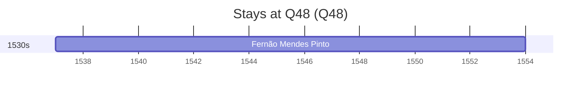

# Q48

*(fetch error: HTTP Error 429: Too Many Requests)*

Wikidata: [Q48](https://www.wikidata.org/wiki/Q48)

2 occurrence(s) across 1 transcribed value(s), 1 person(s).

**Transcribed variants:**

- `Ásia` (2×, 1537–1551)

| Date | Variant | Person | Type | Entity id | Real entity |
|------|---------|--------|------|-----------|-------------|
| 1537 | Ásia | Fernão Mendes Pinto | estadia | [deh-fernao-mendes-pinto](deh-fernao-mendes-pinto) | — |
| 1551 | Ásia | Fernão Mendes Pinto | estadia | [deh-fernao-mendes-pinto](deh-fernao-mendes-pinto) | — |

