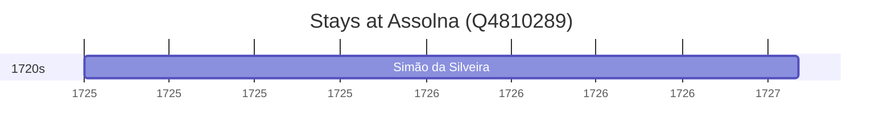

# Assolna (Q4810289)

*human settlement in India*

Wikidata: [Q4810289](https://www.wikidata.org/wiki/Q4810289)

1 occurrence(s) across 1 transcribed value(s), 1 person(s).

**Transcribed variants:**

- `Assolna` (1×, 1725–1725)

| Date | Variant | Person | Type | Entity id | Real entity |
|------|---------|--------|------|-----------|-------------|
| 1725 | Assolna | Simão da Silveira | estadia | [deh-simao-da-silveira](deh-simao-da-silveira) | — |

