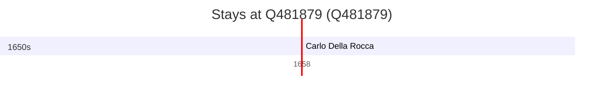

# Q481879

*(fetch error: HTTP Error 429: Too Many Requests)*

Wikidata: [Q481879](https://www.wikidata.org/wiki/Q481879)

1 occurrence(s) across 1 transcribed value(s), 1 person(s).

**Transcribed variants:**

- `Salemi, Sicília` (1×, 1658–1658)

| Date | Variant | Person | Type | Entity id | Real entity |
|------|---------|--------|------|-----------|-------------|
| 1658-11-10 | Salemi, Sicília | Carlo Della Rocca | jesuita-votos-local | [deh-carlo-della-rocca](deh-carlo-della-rocca) | — |

