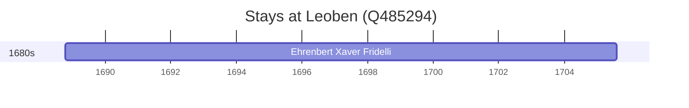

# Leoben (Q485294)

*municipality in Leoben District, Styria, Austria*

Wikidata: [Q485294](https://www.wikidata.org/wiki/Q485294)

1 occurrence(s) across 1 transcribed value(s), 1 person(s).

**Transcribed variants:**

- `Leoben` (1×, 1688–1688)

| Date | Variant | Person | Type | Entity id | Real entity |
|------|---------|--------|------|-----------|-------------|
| 1688-10-12 | Leoben | Ehrenbert Xaver Fridelli | jesuita-entrada | [deh-ehrenbert-xaver-fridelli](deh-ehrenbert-xaver-fridelli) | — |

