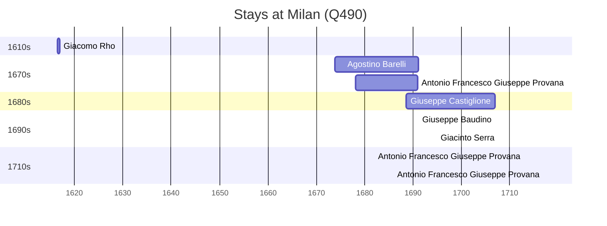

# Milan (Q490)

*Italian commune and capital city of Lombardy*

Wikidata: [Q490](https://www.wikidata.org/wiki/Q490)

8 occurrence(s) across 1 transcribed value(s), 6 person(s).

**Transcribed variants:**

- `Milão` (8×, 1616–1717)

| Date | Variant | Person | Type | Entity id | Real entity |
|------|---------|--------|------|-----------|-------------|
| 1616-06-14 | Milão | Giacomo Rho | estadia | [deh-giacomo-rho](deh-giacomo-rho) | — |
| 1673-10-21 | Milão | Agostino Barelli | jesuita-entrada | [deh-agostino-barelli](deh-agostino-barelli) | — |
| 1678-02-15 | Milão | Antonio Francesco Giuseppe Provana | jesuita-entrada | [deh-antonio-francesco-giuseppe-provana](deh-antonio-francesco-giuseppe-provana) | [rp445313](rp445313) |
| 1688-07-19 | Milão | Giuseppe Castiglione | nascimento | [deh-giuseppe-castiglione](deh-giuseppe-castiglione) | — |
| 1691-02-02 | Milão | Giuseppe Baudino | jesuita-votos-local | [deh-giuseppe-baudino](deh-giuseppe-baudino) | — |
| 1695 | Milão | Giacinto Serra | jesuita-ordenacao-padre | [deh-giacinto-serra](deh-giacinto-serra) | — |
| 1713 | Milão | Antonio Francesco Giuseppe Provana | estadia | [deh-antonio-francesco-giuseppe-provana](deh-antonio-francesco-giuseppe-provana) | [rp445313](rp445313) |
| 1717 | Milão | Antonio Francesco Giuseppe Provana | estadia | [deh-antonio-francesco-giuseppe-provana](deh-antonio-francesco-giuseppe-provana) | [rp445313](rp445313) |

### Co-presence

These persons were plausibly at this place during overlapping periods (interval estimation from stay dates; rough — see method note below).

| Period | Persons |
|--------|---------|
| 1670s | [Agostino Barelli](deh-agostino-barelli), [Antonio Francesco Giuseppe Provana](rp445313) |
| 1680s | [Agostino Barelli](deh-agostino-barelli), [Antonio Francesco Giuseppe Provana](rp445313), [Giuseppe Castiglione](deh-giuseppe-castiglione) |
| 1690s | [Giacinto Serra](deh-giacinto-serra), [Giuseppe Baudino](deh-giuseppe-baudino), [Giuseppe Castiglione](deh-giuseppe-castiglione) |

*5 overlapping pair(s) involving 5 person(s). Method: interval start = stay event date; end = next embarque/partida/different-place event, or death, or +15yr cap.*

