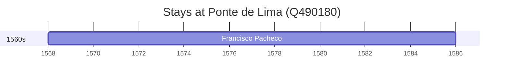

# Ponte de Lima (Q490180)

*municipality of Portugal*

Wikidata: [Q490180](https://www.wikidata.org/wiki/Q490180)

1 occurrence(s) across 1 transcribed value(s), 1 person(s).

**Transcribed variants:**

- `Ponte de Lima, diocese de Braga` (1×, 1568–1568)

| Date | Variant | Person | Type | Entity id | Real entity |
|------|---------|--------|------|-----------|-------------|
| 1568 | Ponte de Lima, diocese de Braga | Francisco Pacheco | nascimento | [deh-francisco-pacheco](deh-francisco-pacheco) | — |

