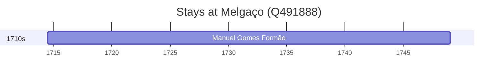

# Melgaço (Q491888)

*municipality of Portugal*

Wikidata: [Q491888](https://www.wikidata.org/wiki/Q491888)

1 occurrence(s) across 1 transcribed value(s), 1 person(s).

**Transcribed variants:**

- `Melgaço, diocese de Braga` (1×, 1714–1714)

| Date | Variant | Person | Type | Entity id | Real entity |
|------|---------|--------|------|-----------|-------------|
| 1714-07-13 | Melgaço, diocese de Braga | Manuel Gomes Formão | nascimento | [deh-manuel-gomes-formao](deh-manuel-gomes-formao) | — |

