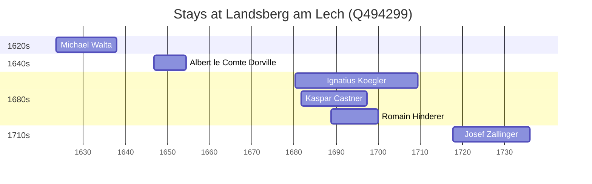

# Landsberg am Lech (Q494299)

*city in Bavaria, Germany*

Wikidata: [Q494299](https://www.wikidata.org/wiki/Q494299)

8 occurrence(s) across 2 transcribed value(s), 7 person(s).

**Transcribed variants:**

- `Landsberg` (7×, 1623–1777)
- `Landsberg-am-Lech, Baviera` (1×, 1680–1680)

| Date | Variant | Person | Type | Entity id | Real entity |
|------|---------|--------|------|-----------|-------------|
| 1623-07-29 | Landsberg | Michael Walta | jesuita-entrada | [deh-michael-walta](deh-michael-walta) | — |
| 1646-11-02 | Landsberg | Albert le Comte Dorville | jesuita-entrada | [deh-albert-le-comte-dorville](deh-albert-le-comte-dorville) | — |
| 1680-05-11 | Landsberg-am-Lech, Baviera | Ignatius Koegler | nascimento | [deh-ignatius-koegler](deh-ignatius-koegler) | — |
| 1681-09-18 | Landsberg | Kaspar Castner | jesuita-entrada | [deh-kaspar-castner](deh-kaspar-castner) | — |
| 1688-09-28 | Landsberg | Romain Hinderer | jesuita-entrada | [deh-romain-hinderer](deh-romain-hinderer) | — |
| 1696-10-04 | Landsberg | Ignatius Koegler | jesuita-entrada | [deh-ignatius-koegler](deh-ignatius-koegler) | — |
| 1717-09-28 | Landsberg | Josef Zallinger | jesuita-entrada | [deh-josef-zallinger](deh-josef-zallinger) | — |
| 1777-04-11 | Landsberg | Sebastian Zwerger | morte | [deh-sebastian-zwerger](deh-sebastian-zwerger) | — |

### Co-presence

These persons were plausibly at this place during overlapping periods (interval estimation from stay dates; rough — see method note below).

| Period | Persons |
|--------|---------|
| 1680s | [Ignatius Koegler](deh-ignatius-koegler), [Kaspar Castner](deh-kaspar-castner), [Romain Hinderer](deh-romain-hinderer) |

*3 overlapping pair(s) involving 3 person(s). Method: interval start = stay event date; end = next embarque/partida/different-place event, or death, or +15yr cap.*

