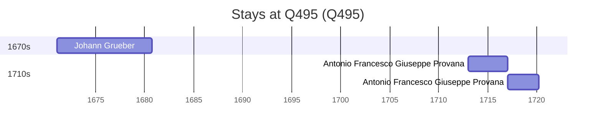

# Q495

*(fetch error: HTTP Error 429: Too Many Requests)*

Wikidata: [Q495](https://www.wikidata.org/wiki/Q495)

5 occurrence(s) across 1 transcribed value(s), 4 person(s).

**Transcribed variants:**

- `Turim` (5×, 1671–1717)

| Date | Variant | Person | Type | Entity id | Real entity |
|------|---------|--------|------|-----------|-------------|
| — | Turim | Louis Fan | estadia | [deh-louis-fan](deh-louis-fan) | — |
| — | Turim | Antonio Francesco Giuseppe Provana | estadia | [deh-louis-fan-ref1](deh-louis-fan-ref1) | [rp445313](rp445313) |
| 1671-01-21 | Turim | Johann Grueber | estadia | [deh-johann-grueber](deh-johann-grueber) | — |
| 1713 | Turim | Antonio Francesco Giuseppe Provana | estadia | [deh-antonio-francesco-giuseppe-provana](deh-antonio-francesco-giuseppe-provana) | [rp445313](rp445313) |
| 1717 | Turim | Antonio Francesco Giuseppe Provana | estadia | [deh-antonio-francesco-giuseppe-provana](deh-antonio-francesco-giuseppe-provana) | [rp445313](rp445313) |

