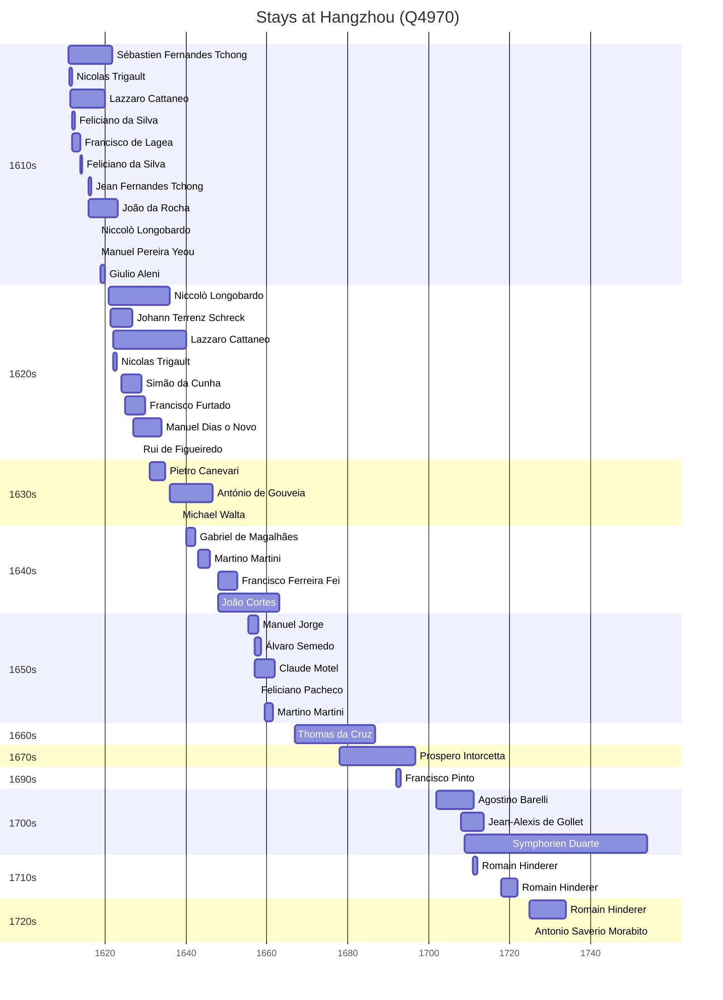

# Hangzhou (Q4970)

*capital of Zhejiang Province, China*

Wikidata: [Q4970](https://www.wikidata.org/wiki/Q4970)

62 occurrence(s) across 11 transcribed value(s), 38 person(s).

**Transcribed variants:**

- `Hangchow` (48×, 1611–1725)
- `Hangchow (Hang-tcheou)` (2×, 1611–1616)
- `Hangchow, Tchokiang` (1×, 1611–1611)
- `Hangchow (Hang-tcheou fou)` (1×, 1617–1617)
- `Hangchow, Hang-tcheou, Chekiang, Tchô-kiang` (1×, 1619–1619)
- `Hang-tcheou` (1×, 1623–1623)
- `Hangchow, Chekiang` (3×, 1648–1708)
- `Hangchow fou, Tchö-kiang` (1×, 1711–1711)
- `Hangchow fou` (1×, 1718–1718)
- `Ham cheu, Che Kiam` (1×, 1725–1725)
- `Hangchow, Tchö-kiang` (2×, undated)

| Date | Variant | Person | Type | Entity id | Real entity |
|------|---------|--------|------|-----------|-------------|
| — | Hangchow, Tchö-kiang | François de Rougemont | estadia | [deh-francois-de-rougemont](deh-francois-de-rougemont) | — |
| — | Hangchow, Tchö-kiang | Jean Baborier | estadia | [deh-jean-baborier](deh-jean-baborier) | — |
| — | Hangchow | João Baptista | estadia | [deh-joao-baptista](deh-joao-baptista) | — |
| — | Hangchow | Rui de Figueiredo | estadia | [deh-rui-de-figueiredo](deh-rui-de-figueiredo) | — |
| 1611 | Hangchow (Hang-tcheou) | Sébastien Fernandes Tchong | estadia | [deh-sebastien-fernandes-tchong](deh-sebastien-fernandes-tchong) | — |
| 1611-05 | Hangchow | Nicolas Trigault | estadia | [deh-nicolas-trigault](deh-nicolas-trigault) | — |
| 1611-05-08 | Hangchow, Tchokiang | Lazzaro Cattaneo | estadia | [deh-lazzaro-cattaneo](deh-lazzaro-cattaneo) | — |
| 1612 | Hangchow | Feliciano da Silva | estadia | [deh-feliciano-da-silva](deh-feliciano-da-silva) | — |
| 1612 | Hangchow | Francisco de Lagea | estadia | [deh-francisco-de-lagea](deh-francisco-de-lagea) | — |
| 1613 | Hangchow | Francisco de Lagea | estadia | [deh-francisco-de-lagea](deh-francisco-de-lagea) | — |
| 1614 | Hangchow | Feliciano da Silva | estadia | [deh-feliciano-da-silva](deh-feliciano-da-silva) | — |
| 1616 | Hangchow (Hang-tcheou) | Jean Fernandes Tchong | estadia | [deh-jean-fernandes-tchong](deh-jean-fernandes-tchong) | — |
| 1617-11-01 | Hangchow | Sébastien Fernandes Tchong | jesuita-votos-local | [deh-sebastien-fernandes-tchong](deh-sebastien-fernandes-tchong) | — |
| 1617-12-24 | Hangchow | Niccolò Longobardo | jesuita-votos-local | [deh-niccolo-longobardo](deh-niccolo-longobardo) | — |
| 1617-12-25 | Hangchow (Hang-tcheou fou) | Manuel Pereira Yeou | jesuita-votos-local | [deh-manuel-pereira-yeou](deh-manuel-pereira-yeou) | — |
| 1619 | Hangchow, Hang-tcheou, Chekiang, Tchô-kiang | Giulio Aleni | estadia | [deh-giulio-aleni](deh-giulio-aleni) | — |
| 1621 | Hangchow | Niccolò Longobardo | estadia | [deh-niccolo-longobardo](deh-niccolo-longobardo) | — |
| 1621-06-26 | Hangchow | Johann Terrenz Schreck | estadia | [deh-johann-terrenz-schreck](deh-johann-terrenz-schreck) | — |
| 1621-11-24 | Hangchow | Sébastien Fernandes Tchong | morte | [deh-sebastien-fernandes-tchong](deh-sebastien-fernandes-tchong) | — |
| 1622 | Hangchow | Lazzaro Cattaneo | estadia | [deh-lazzaro-cattaneo](deh-lazzaro-cattaneo) | — |
| 1622 | Hangchow | Nicolas Trigault | estadia | [deh-nicolas-trigault](deh-nicolas-trigault) | — |
| 1623-03-23 | Hang-tcheou | João da Rocha | morte | [deh-joao-da-rocha](deh-joao-da-rocha) | — |
| 1624 | Hangchow | Simão da Cunha | chegada | [deh-simao-da-cunha](deh-simao-da-cunha) | — |
| 1625 | Hangchow | Francisco Furtado | estadia | [deh-francisco-furtado](deh-francisco-furtado) | — |
| 1626-05-03 | Hangchow | Francisco Furtado | jesuita-votos-local | [deh-francisco-furtado](deh-francisco-furtado) | — |
| 1627 | Hangchow | Manuel Dias, o Novo | estadia | [deh-manuel-dias-o-novo](deh-manuel-dias-o-novo) | — |
| 1628-04-17 | Hangchow | Rui de Figueiredo | jesuita-votos-local | [deh-rui-de-figueiredo](deh-rui-de-figueiredo) | — |
| 1628-11-14 | Hangchow | Nicolas Trigault | morte | [deh-nicolas-trigault](deh-nicolas-trigault) | — |
| 1631 | Hangchow | Lazzaro Cattaneo | estadia | [deh-lazzaro-cattaneo](deh-lazzaro-cattaneo) | — |
| 1631 | Hangchow | Pietro Canevari | estadia | [deh-pietro-canevari](deh-pietro-canevari) | — |
| 1633 | Hangchow | Manuel Pereira Yeou | morte | [deh-manuel-pereira-yeou](deh-manuel-pereira-yeou) | — |
| 1638 | Hangchow | Michael Walta | chegada | [deh-michael-walta](deh-michael-walta) | — |
| 1638-07-01 | Hangchow | João Fróis | morte | [deh-joao-frois](deh-joao-frois) | — |
| 1640 | Hangchow | Gabriel de Magalhães | estadia | [deh-gabriel-de-magalhaes](deh-gabriel-de-magalhaes) | [rp695666](rp695666) |
| 1640-01-19 | Hangchow | Lazzaro Cattaneo | morte | [deh-lazzaro-cattaneo](deh-lazzaro-cattaneo) | — |
| 1643 | Hangchow | Martino Martini | chegada | [deh-martino-martini](deh-martino-martini) | — |
| 1648 | Hangchow | Francisco Ferreira Fei | estadia | [deh-francisco-ferreira-fei](deh-francisco-ferreira-fei) | — |
| 1648 | Hangchow, Chekiang | João Cortes | estadia | [deh-joao-cortes](deh-joao-cortes) | — |
| 1650 | Hangchow | Francisco Ferreira Fei | estadia | [deh-francisco-ferreira-fei](deh-francisco-ferreira-fei) | — |
| 1655-05 | Hangchow | Manuel Jorge | estadia | [deh-manuel-jorge](deh-manuel-jorge) | — |
| 1657 | Hangchow | Álvaro Semedo | estadia | [deh-alvaro-semedo](deh-alvaro-semedo) | — |
| 1657 | Hangchow | Claude Motel | chegada | [deh-claude-motel](deh-claude-motel) | — |
| 1657-05-20 | Hangchow | Feliciano Pacheco | jesuita-votos-local | [deh-feliciano-pacheco](deh-feliciano-pacheco) | — |
| 1659-03-04 | Hangchow | Manuel Dias, o Novo | morte | [deh-manuel-dias-o-novo](deh-manuel-dias-o-novo) | — |
| 1659-06-11 | Hangchow | Martino Martini | chegada | [deh-martino-martini](deh-martino-martini) | — |
| 1661-06-06 | Hangchow | Martino Martini | morte | [deh-martino-martini](deh-martino-martini) | — |
| 1666-12-18 | Hangchow, Chekiang | Thomas da Cruz | nascimento | [deh-thomas-da-cruz](deh-thomas-da-cruz) | — |
| 1678 | Hangchow | Prospero Intorcetta | estadia | [deh-prospero-intorcetta](deh-prospero-intorcetta) | — |
| 1691 | Hangchow | Prospero Intorcetta | estadia | [deh-prospero-intorcetta](deh-prospero-intorcetta) | — |
| 1692 | Hangchow | Francisco Pinto | estadia | [deh-francisco-pinto-i](deh-francisco-pinto-i) | — |
| 1696-10-03 | Hangchow | Prospero Intorcetta | morte | [deh-prospero-intorcetta](deh-prospero-intorcetta) | — |
| 1702 | Hangchow | Agostino Barelli | estadia | [deh-agostino-barelli](deh-agostino-barelli) | — |
| 1708 | Hangchow | Jean-Alexis de Gollet | estadia | [deh-jean-alexis-de-gollet](deh-jean-alexis-de-gollet) | — |
| 1708 | Hangchow | Agostino Barelli | estadia | [deh-agostino-barelli](deh-agostino-barelli) | — |
| 1708-11-12 | Hangchow, Chekiang | Symphorien Duarte | nascimento | [deh-symphorien-duarte](deh-symphorien-duarte) | — |
| 1711 | Hangchow fou, Tchö-kiang | Romain Hinderer | estadia | [deh-romain-hinderer](deh-romain-hinderer) | — |
| 1711-01-29 | Hangchow | Agostino Barelli | morte | [deh-agostino-barelli](deh-agostino-barelli) | — |
| 1718 | Hangchow fou | Romain Hinderer | estadia | [deh-romain-hinderer](deh-romain-hinderer) | — |
| 1725 | Hangchow | Romain Hinderer | estadia | [deh-romain-hinderer](deh-romain-hinderer) | — |
| 1725-02-02 | Ham cheu, Che Kiam | Antonio Saverio Morabito | jesuita-votos-local | [deh-antonio-saverio-morabito](deh-antonio-saverio-morabito) | — |
| >1616 | Hangchow | João da Rocha | estadia | [deh-joao-da-rocha](deh-joao-da-rocha) | — |
| >1636 | Hangchow | António de Gouveia | estadia | [deh-antonio-de-gouvea](deh-antonio-de-gouvea) | — |

### Co-presence

These persons were plausibly at this place during overlapping periods (interval estimation from stay dates; rough — see method note below).

| Period | Persons |
|--------|---------|
| 1610s | [Feliciano da Silva](deh-feliciano-da-silva), [Francisco de Lagea](deh-francisco-de-lagea), [Giulio Aleni](deh-giulio-aleni), [Jean Fernandes Tchong](deh-jean-fernandes-tchong), [João da Rocha](deh-joao-da-rocha), [Lazzaro Cattaneo](deh-lazzaro-cattaneo), [Manuel Pereira Yeou](deh-manuel-pereira-yeou), [Niccolò Longobardo](deh-niccolo-longobardo), [Nicolas Trigault](deh-nicolas-trigault), [Sébastien Fernandes Tchong](deh-sebastien-fernandes-tchong) |
| 1620s | [Francisco Furtado](deh-francisco-furtado), [Johann Terrenz Schreck](deh-johann-terrenz-schreck), [João da Rocha](deh-joao-da-rocha), [Lazzaro Cattaneo](deh-lazzaro-cattaneo), [Manuel Dias, o Novo](deh-manuel-dias-o-novo), [Niccolò Longobardo](deh-niccolo-longobardo), [Nicolas Trigault](deh-nicolas-trigault), [Rui de Figueiredo](deh-rui-de-figueiredo), [Simão da Cunha](deh-simao-da-cunha), [Sébastien Fernandes Tchong](deh-sebastien-fernandes-tchong) |
| 1630s | [António de Gouveia](deh-antonio-de-gouvea), [Lazzaro Cattaneo](deh-lazzaro-cattaneo), [Manuel Dias, o Novo](deh-manuel-dias-o-novo), [Michael Walta](deh-michael-walta), [Niccolò Longobardo](deh-niccolo-longobardo), [Pietro Canevari](deh-pietro-canevari) |
| 1640s | [António de Gouveia](deh-antonio-de-gouvea), [Gabriel de Magalhães](rp695666), [Lazzaro Cattaneo](deh-lazzaro-cattaneo), [Martino Martini](deh-martino-martini) |
| 1650s | [Claude Motel](deh-claude-motel), [Feliciano Pacheco](deh-feliciano-pacheco), [Manuel Jorge](deh-manuel-jorge), [Martino Martini](deh-martino-martini), [Álvaro Semedo](deh-alvaro-semedo) |
| 1670s | [Prospero Intorcetta](deh-prospero-intorcetta), [Thomas da Cruz](deh-thomas-da-cruz) |
| 1690s | [Francisco Pinto](deh-francisco-pinto-i), [Prospero Intorcetta](deh-prospero-intorcetta) |
| 1700s | [Agostino Barelli](deh-agostino-barelli), [Jean-Alexis de Gollet](deh-jean-alexis-de-gollet), [Symphorien Duarte](deh-symphorien-duarte) |
| 1710s | [Agostino Barelli](deh-agostino-barelli), [Jean-Alexis de Gollet](deh-jean-alexis-de-gollet), [Romain Hinderer](deh-romain-hinderer), [Symphorien Duarte](deh-symphorien-duarte) |
| 1720s | [Antonio Saverio Morabito](deh-antonio-saverio-morabito), [Romain Hinderer](deh-romain-hinderer), [Symphorien Duarte](deh-symphorien-duarte) |

*80 overlapping pair(s) involving 32 person(s). Method: interval start = stay event date; end = next embarque/partida/different-place event, or death, or +15yr cap.*

