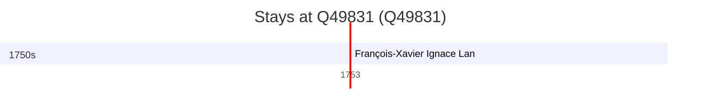

# Q49831

*(fetch error: HTTP Error 429: Too Many Requests)*

Wikidata: [Q49831](https://www.wikidata.org/wiki/Q49831)

1 occurrence(s) across 1 transcribed value(s), 1 person(s).

**Transcribed variants:**

- `Noyon` (1×, 1753–1753)

| Date | Variant | Person | Type | Entity id | Real entity |
|------|---------|--------|------|-----------|-------------|
| 1753-05-28 | Noyon | François-Xavier Ignace Lan | jesuita-ordenacao-padre | [deh-francois-xavier-ignace-lan](deh-francois-xavier-ignace-lan) | — |

