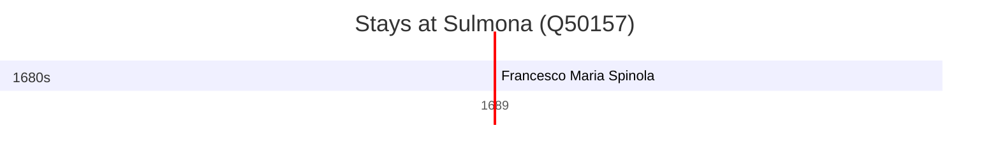

# Sulmona (Q50157)

*Italian comune*

Wikidata: [Q50157](https://www.wikidata.org/wiki/Q50157)

1 occurrence(s) across 1 transcribed value(s), 1 person(s).

**Transcribed variants:**

- `Sulmona` (1×, 1689–1689)

| Date | Variant | Person | Type | Entity id | Real entity |
|------|---------|--------|------|-----------|-------------|
| 1689-08-15 | Sulmona | Francesco Maria Spinola | jesuita-votos-local | [deh-francesco-maria-spinola](deh-francesco-maria-spinola) | [rp574322](rp574322) |

