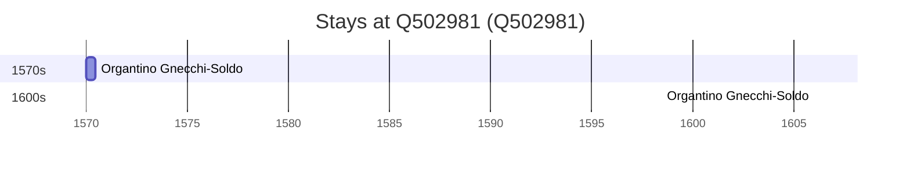

# Q502981

*(fetch error: HTTP Error 429: Too Many Requests)*

Wikidata: [Q502981](https://www.wikidata.org/wiki/Q502981)

2 occurrence(s) across 1 transcribed value(s), 1 person(s).

**Transcribed variants:**

- `Miyako` (2×, 1570–1606)

| Date | Variant | Person | Type | Entity id | Real entity |
|------|---------|--------|------|-----------|-------------|
| 1570 | Miyako | Organtino Gnecchi-Soldo | estadia | [deh-organtino-gnecchi-soldo](deh-organtino-gnecchi-soldo) | — |
| 1606 | Miyako | Organtino Gnecchi-Soldo | estadia | [deh-organtino-gnecchi-soldo](deh-organtino-gnecchi-soldo) | — |

