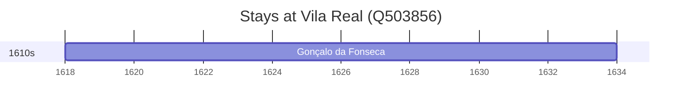

# Vila Real (Q503856)

*municipality in Portugal*

Wikidata: [Q503856](https://www.wikidata.org/wiki/Q503856)

1 occurrence(s) across 1 transcribed value(s), 1 person(s).

**Transcribed variants:**

- `Vila Real, diocese de Braga` (1×, 1618–1618)

| Date | Variant | Person | Type | Entity id | Real entity |
|------|---------|--------|------|-----------|-------------|
| 1618 | Vila Real, diocese de Braga | Gonçalo da Fonseca | nascimento | [deh-goncalo-da-fonseca](deh-goncalo-da-fonseca) | — |

