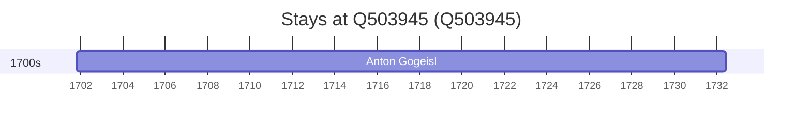

# Q503945

*market municipality of Germany*

Wikidata: [Q503945](https://www.wikidata.org/wiki/Q503945)

1 occurrence(s) across 1 transcribed value(s), 1 person(s).

**Transcribed variants:**

- `Siegenburg, Baviera, diocese de Regensburg` (1×, 1701–1701)

| Date | Variant | Person | Type | Entity id | Real entity |
|------|---------|--------|------|-----------|-------------|
| 1701-10-30 | Siegenburg, Baviera, diocese de Regensburg | Anton Gogeisl | nascimento | [deh-anton-gogeisl](deh-anton-gogeisl) | — |

