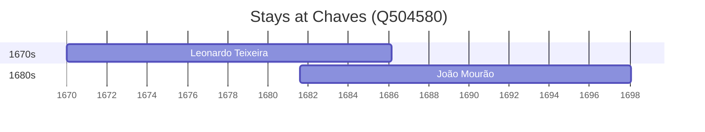

# Chaves (Q504580)

*municipality in Portugal*

Wikidata: [Q504580](https://www.wikidata.org/wiki/Q504580)

2 occurrence(s) across 1 transcribed value(s), 2 person(s).

**Transcribed variants:**

- `Chaves` (2×, 1670–1681)

| Date | Variant | Person | Type | Entity id | Real entity |
|------|---------|--------|------|-----------|-------------|
| 1670 | Chaves | Leonardo Teixeira | nascimento | [deh-leonardo-teixeira](deh-leonardo-teixeira) | — |
| 1681-08-02 | Chaves | João Mourão | nascimento | [deh-joao-mourao](deh-joao-mourao) | — |

### Co-presence

These persons were plausibly at this place during overlapping periods (interval estimation from stay dates; rough — see method note below).

| Period | Persons |
|--------|---------|
| 1680s | [João Mourão](deh-joao-mourao), [Leonardo Teixeira](deh-leonardo-teixeira) |

*1 overlapping pair(s) involving 2 person(s). Method: interval start = stay event date; end = next embarque/partida/different-place event, or death, or +15yr cap.*

