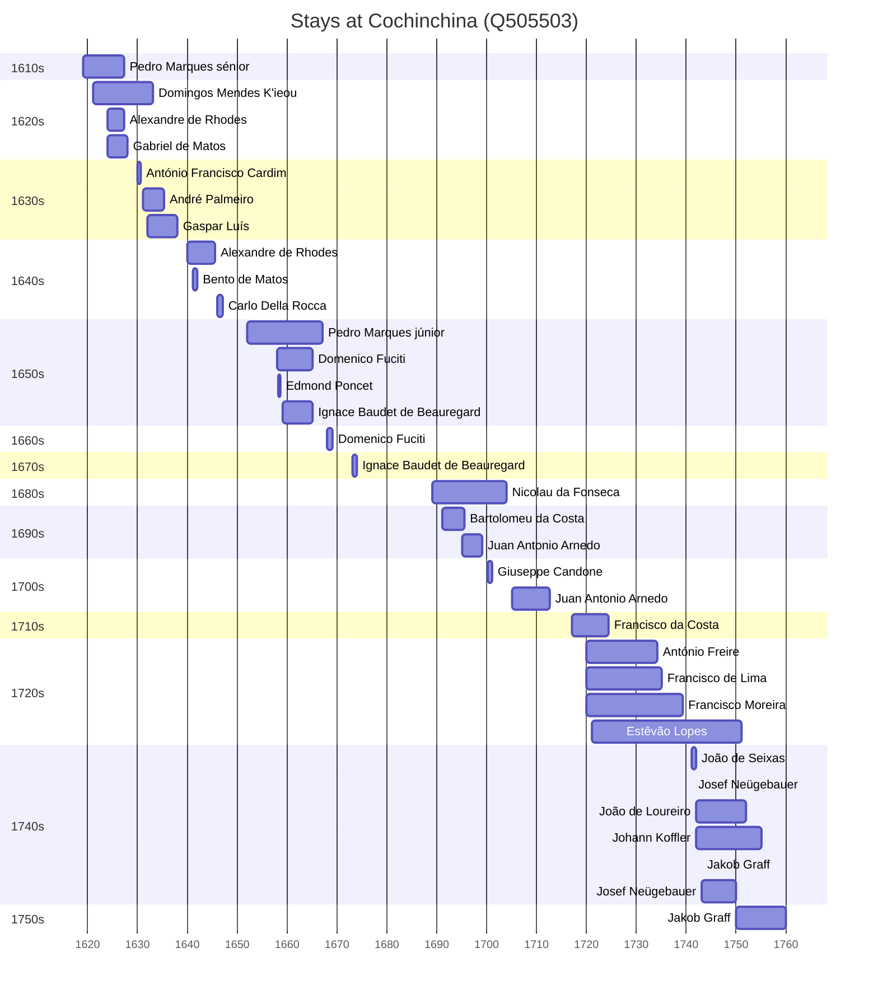

# Cochinchina (Q505503)

*historical region, southern half or third of Vietnam*

Wikidata: [Q505503](https://www.wikidata.org/wiki/Q505503)

50 occurrence(s) across 3 transcribed value(s), 31 person(s).

**Transcribed variants:**

- `Cochinchina` (48×, 1619–1750)
- `Costa da Cochinchina` (1×, 1667–1667)
- `Cochinchina (prisão)` (1×, 1700–1700)

| Date | Variant | Person | Type | Entity id | Real entity |
|------|---------|--------|------|-----------|-------------|
| — | Cochinchina | Bento Ferreira | estadia | [deh-bento-ferreira](deh-bento-ferreira) | — |
| — | Cochinchina | Giuseppe Candone | estadia | [deh-giuseppe-candone](deh-giuseppe-candone) | — |
| — | Cochinchina | Pietro Belmonte | estadia | [deh-pietro-balemonte](deh-pietro-balemonte) | — |
| 1619 | Cochinchina | Pedro Marques, sénior | estadia | [deh-pedro-marques-senior](deh-pedro-marques-senior) | — |
| 1621 | Cochinchina | Domingos Mendes K'ieou | estadia | [deh-domingos-mendes-kieou](deh-domingos-mendes-kieou) | — |
| 1624 | Cochinchina | Alexandre de Rhodes | estadia | [deh-alexandre-de-rhodes](deh-alexandre-de-rhodes) | — |
| 1624 | Cochinchina | Gabriel de Matos | estadia | [deh-gabriel-de-matos](deh-gabriel-de-matos) | — |
| 1625 | Cochinchina | Alexandre de Rhodes | estadia | [deh-alexandre-de-rhodes](deh-alexandre-de-rhodes) | — |
| 1626 | Cochinchina | Domingos Mendes K'ieou | estadia | [deh-domingos-mendes-kieou](deh-domingos-mendes-kieou) | — |
| 1630 | Cochinchina | António Francisco Cardim | estadia | [deh-antonio-francisco-cardim](deh-antonio-francisco-cardim) | [rp536947](rp536947) |
| 1631 | Cochinchina | André Palmeiro | estadia | [deh-andre-palmeiro](deh-andre-palmeiro) | [rp983183](rp983183) |
| 1632 | Cochinchina | Gaspar Luís | estadia | [deh-gaspar-luis](deh-gaspar-luis) | — |
| 1640 | Cochinchina | Alexandre de Rhodes | estadia | [deh-alexandre-de-rhodes](deh-alexandre-de-rhodes) | — |
| 1641 | Cochinchina | Bento de Matos | estadia | [deh-bento-de-matos](deh-bento-de-matos) | — |
| 1645-07-09 | Cochinchina | Alexandre de Rhodes | estadia | [deh-alexandre-de-rhodes](deh-alexandre-de-rhodes) | — |
| 1646 | Cochinchina | Carlo Della Rocca | estadia | [deh-carlo-della-rocca](deh-carlo-della-rocca) | — |
| 1652 | Cochinchina | Pedro Marques, júnior | estadia | [deh-pedro-marques-junior](deh-pedro-marques-junior) | — |
| 1654 | Cochinchina | Pedro Marques, júnior | estadia | [deh-pedro-marques-junior](deh-pedro-marques-junior) | — |
| 1658 | Cochinchina | Domenico Fuciti | estadia | [deh-domenico-fuciti](deh-domenico-fuciti) | — |
| 1658-03-02 | Cochinchina | Edmond Poncet | estadia | [deh-edmond-poncet](deh-edmond-poncet) | — |
| 1659 | Cochinchina | Ignace Baudet de Beauregard | estadia | [deh-ignace-baudet-de-beauregard](deh-ignace-baudet-de-beauregard) | — |
| 1659-06-24 | Cochinchina | Pedro Marques, júnior | jesuita-votos-local | [deh-pedro-marques-junior](deh-pedro-marques-junior) | — |
| 1667-01-15 | Costa da Cochinchina | Matias da Maia | morte | [deh-matias-da-maia](deh-matias-da-maia) | — |
| 1668 | Cochinchina | Domenico Fuciti | estadia | [deh-domenico-fuciti](deh-domenico-fuciti) | — |
| 1670 | Cochinchina | Pedro Marques, júnior | estadia | [deh-pedro-marques-junior](deh-pedro-marques-junior) | — |
| 1673 | Cochinchina | Ignace Baudet de Beauregard | estadia | [deh-ignace-baudet-de-beauregard](deh-ignace-baudet-de-beauregard) | — |
| 1689 | Cochinchina | Nicolau da Fonseca | estadia | [deh-nicolau-da-fonseca](deh-nicolau-da-fonseca) | — |
| 1691 | Cochinchina | Bartolomeu da Costa | estadia | [deh-bartolomeu-da-costa](deh-bartolomeu-da-costa) | — |
| 1694-07-07 | Cochinchina | Francesco Maria Spinola | morte | [deh-francesco-maria-spinola](deh-francesco-maria-spinola) | [rp574322](rp574322) |
| 1695 | Cochinchina | Juan Antonio Arnedo | estadia | [deh-juan-antonio-arnedo](deh-juan-antonio-arnedo) | [rp780907](rp780907) |
| 1695-07-04 | Cochinchina | Bartolomeu da Costa | morte | [deh-bartolomeu-da-costa](deh-bartolomeu-da-costa) | — |
| 1700-03-12 | Cochinchina | Giuseppe Candone | estadia | [deh-giuseppe-candone](deh-giuseppe-candone) | — |
| 1700-05-27 | Cochinchina (prisão) | Pietro Belmonte | morte | [deh-pietro-balemonte](deh-pietro-balemonte) | — |
| 1705 | Cochinchina | Juan Antonio Arnedo | estadia | [deh-juan-antonio-arnedo](deh-juan-antonio-arnedo) | [rp780907](rp780907) |
| 1717 | Cochinchina | Francisco da Costa | estadia | [deh-francisco-da-costa](deh-francisco-da-costa) | — |
| 1720 | Cochinchina | António Freire | estadia | [deh-antonio-freire](deh-antonio-freire) | — |
| 1720 | Cochinchina | Francisco de Lima | estadia | [deh-francisco-de-lima](deh-francisco-de-lima) | — |
| 1720 | Cochinchina | Francisco Moreira | estadia | [deh-francisco-moreira](deh-francisco-moreira) | — |
| 1721 | Cochinchina | Estêvão Lopes | estadia | [deh-estevao-lopes](deh-estevao-lopes) | — |
| 1722-10-04 | Cochinchina | Francisco de Lima | jesuita-votos-local | [deh-francisco-de-lima](deh-francisco-de-lima) | — |
| 1726-06-16 | Cochinchina | Estêvão Lopes | jesuita-votos-local | [deh-estevao-lopes](deh-estevao-lopes) | — |
| 1741 | Cochinchina | João de Seixas | chegada | [deh-joao-de-seixas](deh-joao-de-seixas) | — |
| 1741-05-28 | Cochinchina | Josef Neügebauer | jesuita-votos-local | [deh-josef-neugebauer](deh-josef-neugebauer) | — |
| 1742 | Cochinchina | João de Loureiro | estadia | [deh-joao-de-loureiro](deh-joao-de-loureiro) | — |
| 1742 | Cochinchina | Johann Koffler | estadia | [deh-johann-koffler](deh-johann-koffler) | — |
| 1743 | Cochinchina | Jakob Graff | estadia | [deh-jakob-graff](deh-jakob-graff) | — |
| 1743 | Cochinchina | Josef Neügebauer | estadia | [deh-josef-neugebauer](deh-josef-neugebauer) | — |
| 1744-08-15 | Cochinchina | Johann Koffler | jesuita-votos-local | [deh-johann-koffler](deh-johann-koffler) | — |
| 1750 | Cochinchina | Jakob Graff | estadia | [deh-jakob-graff](deh-jakob-graff) | — |
| 1750 | Cochinchina | Josef Neügebauer | estadia | [deh-josef-neugebauer](deh-josef-neugebauer) | — |

### Co-presence

These persons were plausibly at this place during overlapping periods (interval estimation from stay dates; rough — see method note below).

| Period | Persons |
|--------|---------|
| 1620s | [Alexandre de Rhodes](deh-alexandre-de-rhodes), [Domingos Mendes K'ieou](deh-domingos-mendes-kieou), [Gabriel de Matos](deh-gabriel-de-matos), [Pedro Marques, sénior](deh-pedro-marques-senior) |
| 1630s | [André Palmeiro](rp983183), [António Francisco Cardim](rp536947), [Domingos Mendes K'ieou](deh-domingos-mendes-kieou), [Gaspar Luís](deh-gaspar-luis) |
| 1640s | [Alexandre de Rhodes](deh-alexandre-de-rhodes), [Bento de Matos](deh-bento-de-matos) |
| 1650s | [Domenico Fuciti](deh-domenico-fuciti), [Edmond Poncet](deh-edmond-poncet), [Ignace Baudet de Beauregard](deh-ignace-baudet-de-beauregard) |
| 1690s | [Bartolomeu da Costa](deh-bartolomeu-da-costa), [Juan Antonio Arnedo](rp780907) |
| 1720s | [António Freire](deh-antonio-freire), [Estêvão Lopes](deh-estevao-lopes), [Francisco Moreira](deh-francisco-moreira), [Francisco da Costa](deh-francisco-da-costa) |
| 1740s | [Estêvão Lopes](deh-estevao-lopes), [Jakob Graff](deh-jakob-graff), [Johann Koffler](deh-johann-koffler), [Josef Neügebauer](deh-josef-neugebauer), [João de Loureiro](deh-joao-de-loureiro), [João de Seixas](deh-joao-de-seixas) |
| 1750s | [Estêvão Lopes](deh-estevao-lopes), [Jakob Graff](deh-jakob-graff), [Johann Koffler](deh-johann-koffler), [João de Loureiro](deh-joao-de-loureiro) |

*36 overlapping pair(s) involving 22 person(s). Method: interval start = stay event date; end = next embarque/partida/different-place event, or death, or +15yr cap.*

