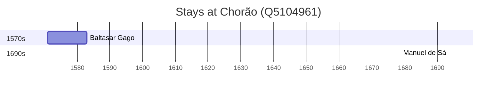

# Chorão (Q5104961)

*village and river island in Goa, India*

Wikidata: [Q5104961](https://www.wikidata.org/wiki/Q5104961)

2 occurrence(s) across 1 transcribed value(s), 2 person(s).

**Transcribed variants:**

- `Chorão` (2×, 1571–1693)

| Date | Variant | Person | Type | Entity id | Real entity |
|------|---------|--------|------|-----------|-------------|
| 1571 | Chorão | Baltasar Gago | estadia | [deh-baltasar-gago](deh-baltasar-gago) | — |
| 1693-08-15 | Chorão | Manuel de Sá | jesuita-votos-local | [deh-manuel-de-sa](deh-manuel-de-sa) | — |

