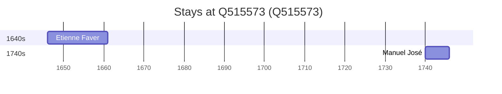

# Q515573

*(fetch error: HTTP Error 429: Too Many Requests)*

Wikidata: [Q515573](https://www.wikidata.org/wiki/Q515573)

2 occurrence(s) across 2 transcribed value(s), 2 person(s).

**Transcribed variants:**

- `Hanchung (Han-tchong) fou, Shansi` (1×, 1646–1646)
- `Hanchung (Han-tchong fou, Shansi)` (1×, 1740–1740)

| Date | Variant | Person | Type | Entity id | Real entity |
|------|---------|--------|------|-----------|-------------|
| 1646 | Hanchung (Han-tchong) fou, Shansi | Etienne Faver | estadia | [deh-etienne-faber](deh-etienne-faber) | — |
| 1740 | Hanchung (Han-tchong fou, Shansi) | Manuel José | chegada | [deh-manuel-jose](deh-manuel-jose) | — |

