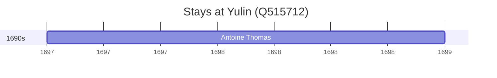

# Yulin (Q515712)

*prefecture-level city in Shaanxi Province, China*

Wikidata: [Q515712](https://www.wikidata.org/wiki/Q515712)

1 occurrence(s) across 1 transcribed value(s), 1 person(s).

**Transcribed variants:**

- `Yu-lin, Chen-si` (1×, 1697–1697)

| Date | Variant | Person | Type | Entity id | Real entity |
|------|---------|--------|------|-----------|-------------|
| 1697-04 | Yu-lin, Chen-si | Antoine Thomas | estadia | [deh-antoine-thomas](deh-antoine-thomas) | [rp486350](rp486350) |

