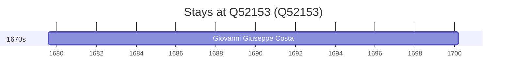

# Q52153

*(fetch error: HTTP Error 429: Too Many Requests)*

Wikidata: [Q52153](https://www.wikidata.org/wiki/Q52153)

1 occurrence(s) across 1 transcribed value(s), 1 person(s).

**Transcribed variants:**

- `Maglie, Itália` (1×, 1679–1679)

| Date | Variant | Person | Type | Entity id | Real entity |
|------|---------|--------|------|-----------|-------------|
| 1679-08-06 | Maglie, Itália | Giovanni Giuseppe Costa | nascimento | [deh-giovanni-giuseppe-costa](deh-giovanni-giuseppe-costa) | — |

