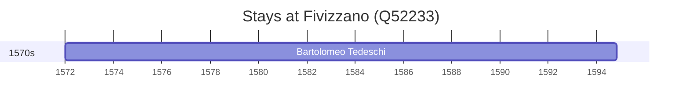

# Fivizzano (Q52233)

*Italian comune*

Wikidata: [Q52233](https://www.wikidata.org/wiki/Q52233)

1 occurrence(s) across 1 transcribed value(s), 1 person(s).

**Transcribed variants:**

- `Fivizzano` (1×, 1572–1572)

| Date | Variant | Person | Type | Entity id | Real entity |
|------|---------|--------|------|-----------|-------------|
| 1572 | Fivizzano | Bartolomeo Tedeschi | nascimento | [deh-bartolomeo-tedeschi](deh-bartolomeo-tedeschi) | [rp086162](rp086162) |

