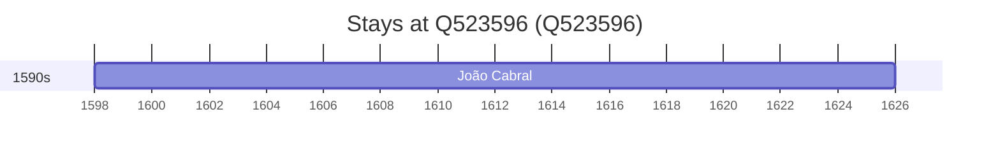

# Q523596

*(fetch error: HTTP Error 429: Too Many Requests)*

Wikidata: [Q523596](https://www.wikidata.org/wiki/Q523596)

1 occurrence(s) across 1 transcribed value(s), 1 person(s).

**Transcribed variants:**

- `Celorico da Beira` (1×, 1598–1598)

| Date | Variant | Person | Type | Entity id | Real entity |
|------|---------|--------|------|-----------|-------------|
| 1598 | Celorico da Beira | João Cabral | nascimento | [deh-joao-cabral](deh-joao-cabral) | — |

