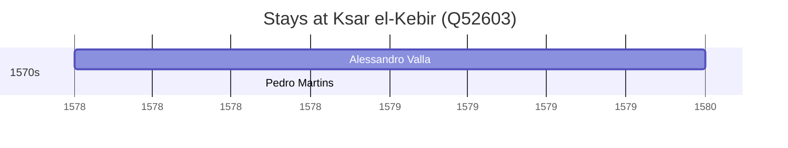

# Ksar el-Kebir (Q52603)

*city in northwest Morocco*

Wikidata: [Q52603](https://www.wikidata.org/wiki/Q52603)

2 occurrence(s) across 1 transcribed value(s), 2 person(s).

**Transcribed variants:**

- `Alcácer-Quibir` (2×, 1578–1578)

| Date | Variant | Person | Type | Entity id | Real entity |
|------|---------|--------|------|-----------|-------------|
| 1578 | Alcácer-Quibir | Alessandro Valla | estadia | [deh-alessandro-valla](deh-alessandro-valla) | — |
| 1578-08-04 | Alcácer-Quibir | Pedro Martins | estadia | [deh-pedro-martins](deh-pedro-martins) | — |

### Co-presence

These persons were plausibly at this place during overlapping periods (interval estimation from stay dates; rough — see method note below).

| Period | Persons |
|--------|---------|
| 1570s | [Alessandro Valla](deh-alessandro-valla), [Pedro Martins](deh-pedro-martins) |

*1 overlapping pair(s) involving 2 person(s). Method: interval start = stay event date; end = next embarque/partida/different-place event, or death, or +15yr cap.*

