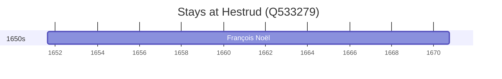

# Hestrud (Q533279)

*commune in Nord, France*

Wikidata: [Q533279](https://www.wikidata.org/wiki/Q533279)

1 occurrence(s) across 1 transcribed value(s), 1 person(s).

**Transcribed variants:**

- `Hestrud, Hainaut` (1×, 1651–1651)

| Date | Variant | Person | Type | Entity id | Real entity |
|------|---------|--------|------|-----------|-------------|
| 1651-08-18 | Hestrud, Hainaut | François Noël | nascimento | [deh-francois-noel](deh-francois-noel) | — |

