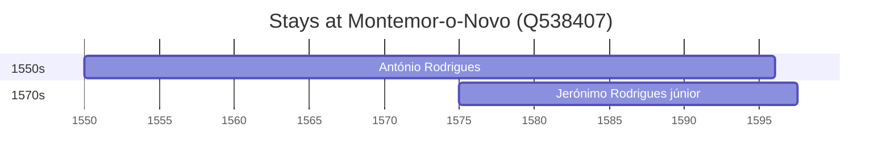

# Montemor-o-Novo (Q538407)

*municipality in Portugal*

Wikidata: [Q538407](https://www.wikidata.org/wiki/Q538407)

2 occurrence(s) across 1 transcribed value(s), 2 person(s).

**Transcribed variants:**

- `Montemor-o-Novo, diocese de Évora` (2×, 1550–1575)

| Date | Variant | Person | Type | Entity id | Real entity |
|------|---------|--------|------|-----------|-------------|
| 1550 | Montemor-o-Novo, diocese de Évora | António Rodrigues | nascimento | [deh-antonio-rodrigues](deh-antonio-rodrigues) | — |
| 1575 | Montemor-o-Novo, diocese de Évora | Jerónimo Rodrigues, júnior | nascimento | [deh-jeronimo-rodrigues-junior](deh-jeronimo-rodrigues-junior) | — |

### Co-presence

These persons were plausibly at this place during overlapping periods (interval estimation from stay dates; rough — see method note below).

| Period | Persons |
|--------|---------|
| 1570s | [António Rodrigues](deh-antonio-rodrigues), [Jerónimo Rodrigues, júnior](deh-jeronimo-rodrigues-junior) |

*1 overlapping pair(s) involving 2 person(s). Method: interval start = stay event date; end = next embarque/partida/different-place event, or death, or +15yr cap.*

