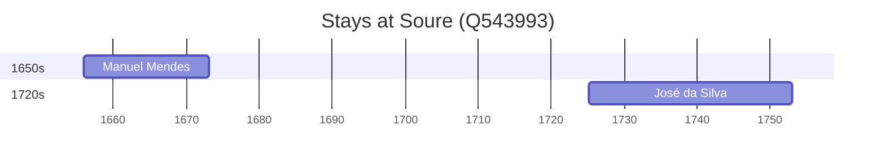

# Soure (Q543993)

*municipality and town of Portugal*

Wikidata: [Q543993](https://www.wikidata.org/wiki/Q543993)

3 occurrence(s) across 2 transcribed value(s), 3 person(s).

**Transcribed variants:**

- `?` (1×, 1656–1656)
- `Soure, diocese de Coimbra` (2×, 1656–1725)

| Date | Variant | Person | Type | Entity id | Real entity |
|------|---------|--------|------|-----------|-------------|
| 1656 | ? | Manuel Lopes | nascimento | [deh-manuel-lopes-ref4](deh-manuel-lopes-ref4) | [rp352197](rp352197) |
| 1656-01-01 | Soure, diocese de Coimbra | Manuel Mendes | nascimento | [deh-manuel-mendes](deh-manuel-mendes) | [rp352197](rp352197) |
| 1725-02-10 | Soure, diocese de Coimbra | José da Silva | nascimento | [deh-jose-da-silva](deh-jose-da-silva) | — |

