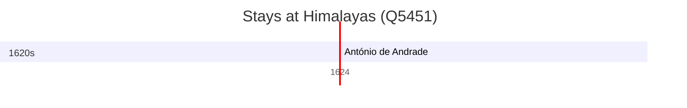

# Himalayas (Q5451)

*mountain range in Asia*

Wikidata: [Q5451](https://www.wikidata.org/wiki/Q5451)

1 occurrence(s) across 1 transcribed value(s), 1 person(s).

**Transcribed variants:**

- `Himalaias` (1×, undated)

| Date | Variant | Person | Type | Entity id | Real entity |
|------|---------|--------|------|-----------|-------------|
| >1624:<1624-11-15 | Himalaias | António de Andrade | estadia | [deh-antonio-de-andrade](deh-antonio-de-andrade) | — |

