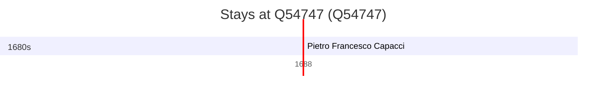

# Q54747

*(fetch error: HTTP Error 429: Too Many Requests)*

Wikidata: [Q54747](https://www.wikidata.org/wiki/Q54747)

1 occurrence(s) across 1 transcribed value(s), 1 person(s).

**Transcribed variants:**

- `Tropea, Calábria` (1×, 1688–1688)

| Date | Variant | Person | Type | Entity id | Real entity |
|------|---------|--------|------|-----------|-------------|
| 1688-02-02 | Tropea, Calábria | Pietro Francesco Capacci | jesuita-votos-local | [deh-pietro-francesco-capacci](deh-pietro-francesco-capacci) | — |

