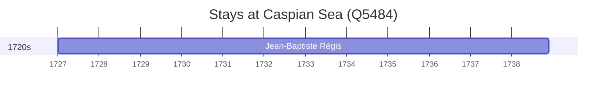

# Caspian Sea (Q5484)

*largest landlocked salt lake, located between Europe and Asia*

Wikidata: [Q5484](https://www.wikidata.org/wiki/Q5484)

1 occurrence(s) across 1 transcribed value(s), 1 person(s).

**Transcribed variants:**

- `Mar Cáspio` (1×, 1727–1727)

| Date | Variant | Person | Type | Entity id | Real entity |
|------|---------|--------|------|-----------|-------------|
| 1727 | Mar Cáspio | Jean-Baptiste Régis | estadia | [deh-jean-baptiste-regis](deh-jean-baptiste-regis) | — |

