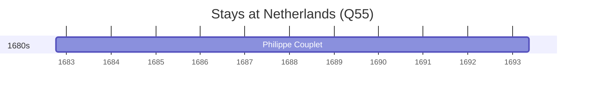

# Netherlands (Q55)

*one of the four autonomous countries of the Kingdom of the Netherlands; with territories in the Caribbean*

Wikidata: [Q55](https://www.wikidata.org/wiki/Q55)

2 occurrence(s) across 1 transcribed value(s), 2 person(s).

**Transcribed variants:**

- `Holanda` (2×, 1682–1682)

| Date | Variant | Person | Type | Entity id | Real entity |
|------|---------|--------|------|-----------|-------------|
| — | Holanda | Carlo Giovanni Turcotti | estadia | [deh-carlo-giovanni-turcotti](deh-carlo-giovanni-turcotti) | — |
| 1682-10-08 | Holanda | Philippe Couplet | estadia | [deh-philippe-couplet](deh-philippe-couplet) | [rp551005](rp551005) |

