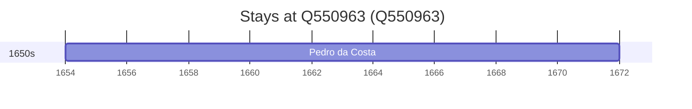

# Q550963

*(fetch error: HTTP Error 429: Too Many Requests)*

Wikidata: [Q550963](https://www.wikidata.org/wiki/Q550963)

1 occurrence(s) across 1 transcribed value(s), 1 person(s).

**Transcribed variants:**

- `Serpa, diocese de Évora` (1×, 1654–1654)

| Date | Variant | Person | Type | Entity id | Real entity |
|------|---------|--------|------|-----------|-------------|
| 1654 | Serpa, diocese de Évora | Pedro da Costa | nascimento | [deh-pedro-da-costa-i](deh-pedro-da-costa-i) | — |

