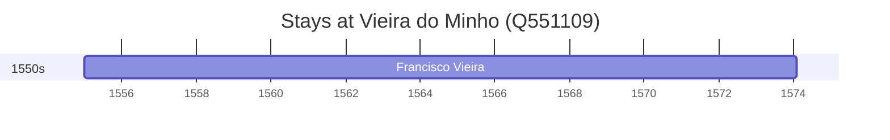

# Vieira do Minho (Q551109)

*municipality of Portugal*

Wikidata: [Q551109](https://www.wikidata.org/wiki/Q551109)

1 occurrence(s) across 1 transcribed value(s), 1 person(s).

**Transcribed variants:**

- `Vieira do Minho` (1×, 1555–1555)

| Date | Variant | Person | Type | Entity id | Real entity |
|------|---------|--------|------|-----------|-------------|
| 1555 | Vieira do Minho | Francisco Vieira | nascimento | [deh-francisco-vieira](deh-francisco-vieira) | — |

