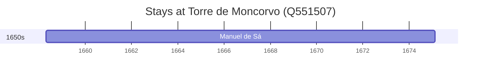

# Torre de Moncorvo (Q551507)

*municipality of Portugal*

Wikidata: [Q551507](https://www.wikidata.org/wiki/Q551507)

1 occurrence(s) across 1 transcribed value(s), 1 person(s).

**Transcribed variants:**

- `Torre de Moncorvo, diocese de Braga` (1×, 1658–1658)

| Date | Variant | Person | Type | Entity id | Real entity |
|------|---------|--------|------|-----------|-------------|
| 1658-04-22 | Torre de Moncorvo, diocese de Braga | Manuel de Sá | nascimento | [deh-manuel-de-sa](deh-manuel-de-sa) | — |

