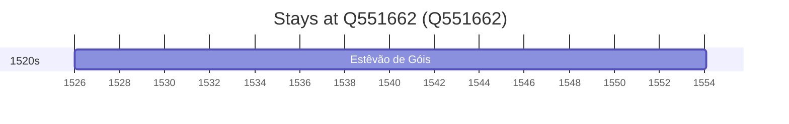

# Q551662

*(fetch error: HTTP Error 429: Too Many Requests)*

Wikidata: [Q551662](https://www.wikidata.org/wiki/Q551662)

1 occurrence(s) across 1 transcribed value(s), 1 person(s).

**Transcribed variants:**

- `Moura, diocese de Évora` (1×, 1526–1526)

| Date | Variant | Person | Type | Entity id | Real entity |
|------|---------|--------|------|-----------|-------------|
| 1526 | Moura, diocese de Évora | Estêvão de Góis | nascimento | [deh-estevao-de-gois](deh-estevao-de-gois) | — |

