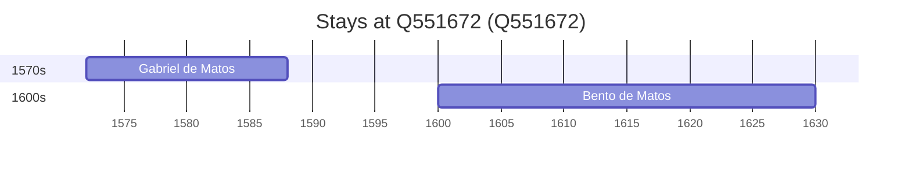

# Q551672

*(fetch error: HTTP Error 429: Too Many Requests)*

Wikidata: [Q551672](https://www.wikidata.org/wiki/Q551672)

2 occurrence(s) across 1 transcribed value(s), 2 person(s).

**Transcribed variants:**

- `Vidigueira, diocese de Évora` (2×, 1572–1600)

| Date | Variant | Person | Type | Entity id | Real entity |
|------|---------|--------|------|-----------|-------------|
| 1572 | Vidigueira, diocese de Évora | Gabriel de Matos | nascimento | [deh-gabriel-de-matos](deh-gabriel-de-matos) | — |
| 1600 | Vidigueira, diocese de Évora | Bento de Matos | nascimento | [deh-bento-de-matos](deh-bento-de-matos) | — |

