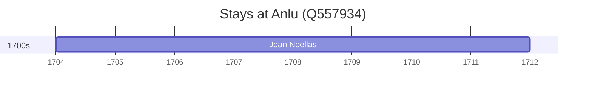

# Anlu (Q557934)

*county-level city*

Wikidata: [Q557934](https://www.wikidata.org/wiki/Q557934)

2 occurrence(s) across 2 transcribed value(s), 2 person(s).

**Transcribed variants:**

- `Anlu (Ngan-lou), Hupei` (1×, 1704–1704)
- `Anlo (Ngan-lo), Hupeh` (1×, undated)

| Date | Variant | Person | Type | Entity id | Real entity |
|------|---------|--------|------|-----------|-------------|
| — | Anlo (Ngan-lo), Hupeh | Louis-Marie Dugad | estadia | [deh-louis-marie-dugad](deh-louis-marie-dugad) | — |
| 1704 | Anlu (Ngan-lou), Hupei | Jean Noëllas | estadia | [deh-jean-noellas](deh-jean-noellas) | — |

