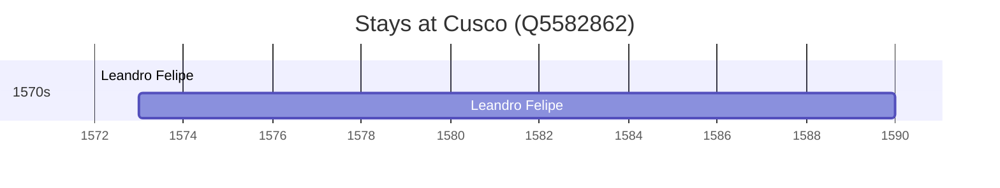

# Cusco (Q5582862)

*historic city of Peru, capital of the Department of Cusco*

Wikidata: [Q5582862](https://www.wikidata.org/wiki/Q5582862)

2 occurrence(s) across 1 transcribed value(s), 1 person(s).

**Transcribed variants:**

- `Cusco (colégio), Peru` (2×, 1572–1573)

| Date | Variant | Person | Type | Entity id | Real entity |
|------|---------|--------|------|-----------|-------------|
| 1572 | Cusco (colégio), Peru | Leandro Felipe | jesuita-votos-local | [deh-leandro-felipe](deh-leandro-felipe) | — |
| 1573 | Cusco (colégio), Peru | Leandro Felipe | estadia | [deh-leandro-felipe](deh-leandro-felipe) | — |

